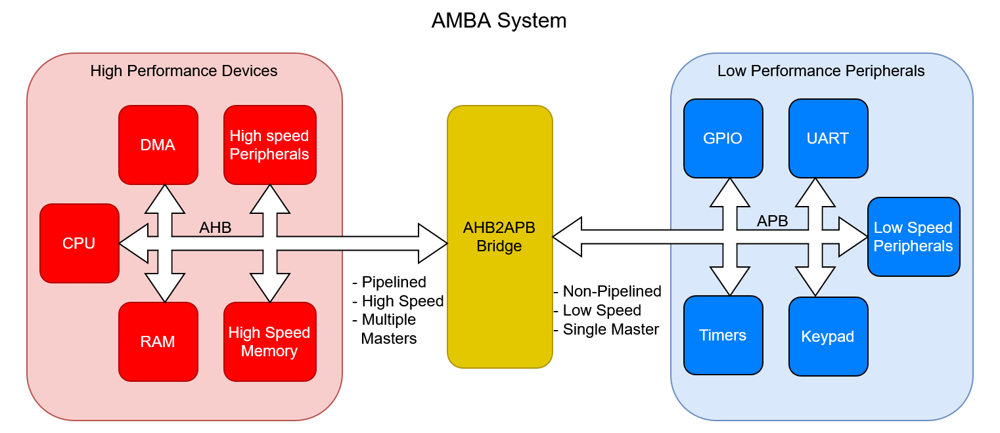
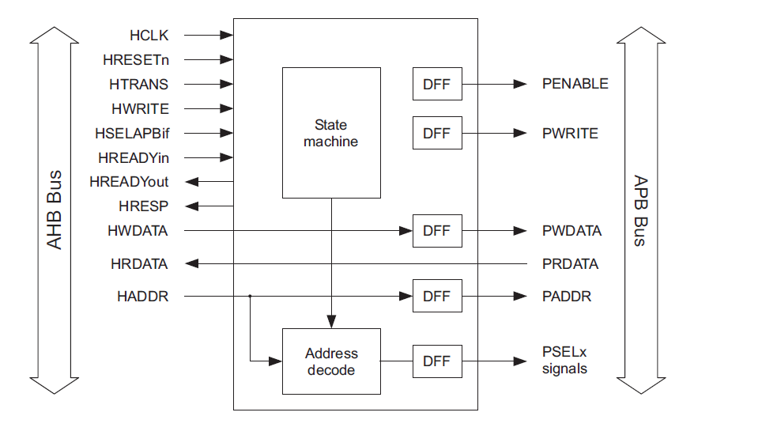
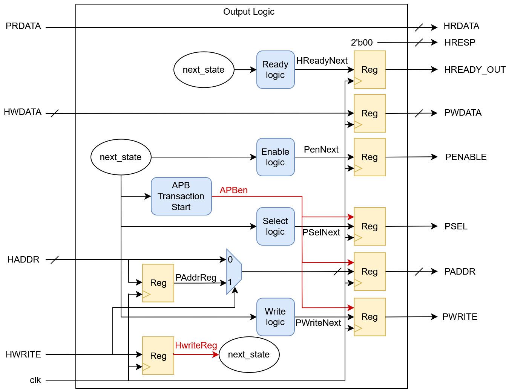
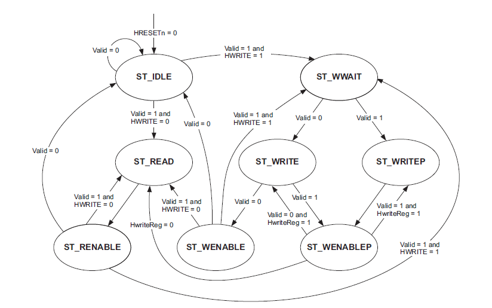
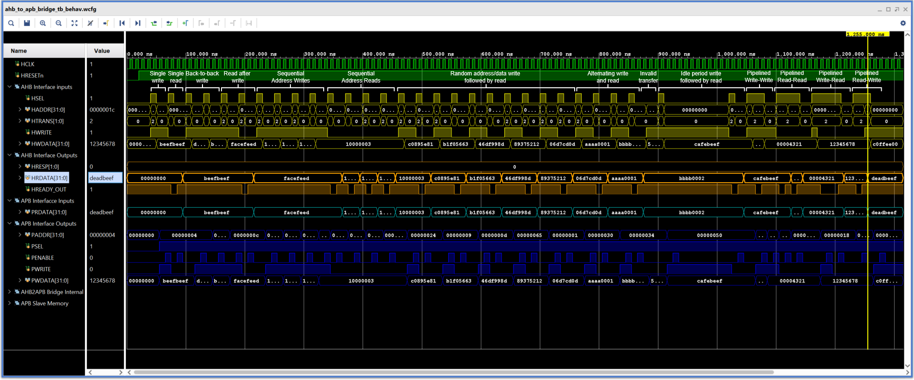
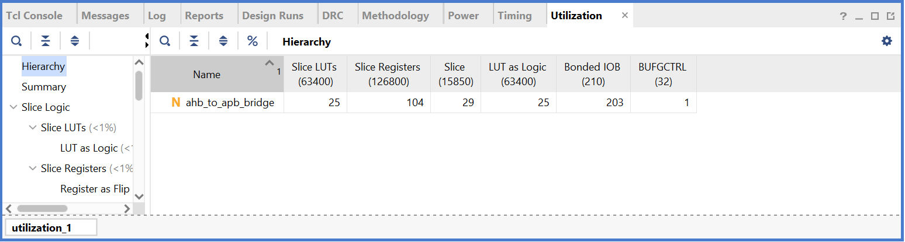

# 🧩 AMBA Protocols - AHB2APB Bridge

This repository contains **SystemVerilog implementations and verification** of **AMBA (Advanced Microcontroller Bus Architecture)** protocols, currently an **AHB-to-APB bridge**.  
The goal is to understand and model **bus-level communication protocols** widely used in SoCs for connecting high-performance and peripheral devices.

---

## 📑 Table of Contents

* [Introduction](#-introduction)
* [AMBA Overview](#-amba-overview)
* [Need for AHB-to-APB Bridge](#-need-for-ahb-to-apb-bridge)
* [Bridge Architecture](#-bridge-architecture)
* [Interface Description](#-interface-description)
* [Repository Structure](#-repository-structure)
* [Verification](#-verification)
* [FPGA Resource Utilization](#-fpga-resource-utilization)
* [Future Work](#-future-work)
* [References](#-references)
* [License](#-license)
* [Contributions](#-contributions)

---

## 📊 Introduction

The **Advanced Microcontroller Bus Architecture (AMBA)** family of protocols by ARM defines **standardized interfaces** for communication between components in a System-on-Chip (SoC).  
It improves interoperability between IP cores and simplifies integration by providing well-defined **bus interfaces** for masters, slaves, and bridges.

This repository includes:

- ✅ **Synchronous AHB-to-APB bridge** implementation with FSM-based control  
- ✅ **Testbenches** to validate protocol behavior  
- ✅ Parameterized and reusable SystemVerilog code
- ✅ AHB APB Interfaces for easy future extension

---

## 🧠 AMBA Overview

The AMBA specification defines multiple bus protocols tailored to different performance and complexity requirements:

| Protocol | Purpose | Typical Use Case |
|-----------|----------|------------------|
| **AHB (Advanced High-performance Bus)** | High-performance, pipelined system bus | CPU, DMA, Memory, High-speed peripherals |
| **APB (Advanced Peripheral Bus)**  | Low-power, simple interface | UART, Timer, GPIO, Low-speed peripherals |
| **AXI (Advanced eXtensible Interface)** | High-performance, high-frequency bus with burst and out-of-order transactions | Multi-core CPUs, GPUs, DDR controllers |

Each protocol builds upon the previous one, allowing a **hierarchical interconnect**.  
The AHB and AXI buses are typically used in **high-speed domains**, while APB is used for **low-speed peripheral access**.



---

## 🔄 Need for AHB-to-APB Bridge

The **AHB-to-APB bridge** acts as a protocol converter between the **high-performance AHB system bus** and the **low-power APB peripheral bus**.  
Since AHB supports pipelined, burst-based communication and APB is non-pipelined, a bridge is required to **translate transactions** while maintaining timing and data integrity.

**Key responsibilities of the AHB-to-APB bridge:**
1. Decode AHB address and generate corresponding **PSEL** for the targeted APB slave.
2. Manage **handshaking and timing** between clock domains (if `HCLK` ≠ `PCLK`).
3. Convert AHB **read/write control signals** into APB-compliant signals.
4. Insert appropriate **wait states** to synchronize slower peripherals.

---

## 🧱 Bridge Architecture

The AHB-to-APB bridge consists of:
- **Address Decoder** — Identifies which APB slave is being accessed. (Single slave in this repo so no decoding)
- **Clock Domain crossing handshake** — Use FIFO or handshaking with synchrnoizers in case asynchrnouns bridge. (This repo has implementation of a synchrnous bridge)
- **State Machine (FSM)** — Controls signal transitions across the two protocols.
- **Register Stage** — Buffers data and address signals between AHB and APB domains.



*(FSM diagram source: ARM Example AMBA System Technical Reference Manual [DDI0170])*  

### 🔌 Block Diagram

The following diagram shows the **connectivity and signal flow** between the AHB and APB domains through the bridge:



---

### ⚙️ FSM Description

The **Finite State Machine (FSM)** manages protocol conversion between AHB and APB phases.  
It ensures correct signal sequencing for setup and enable phases of the APB, while responding appropriately to AHB transactions.



*(FSM diagram source: ARM Example AMBA System Technical Reference Manual [DDI0170])*  

**FSM States:**
1. **ST_IDLE** – Idle state where PSEL and PENABLE are low, waiting for a valid AHB read or write transfer.
2. **ST_READ** – Sets up an APB read transfer and asserting the appropriate PSEL.
3. **ST_WWAIT** – Waits for AHB write data to become valid before starting the corresponding APB write transfer.
4. **ST_WRITE** – Initiates an APB write by asserting PSEL and PWRITE, completing a single write transfer.
5. **ST_WRITEP** – Handles a pipelined APB write while inserting a wait state to maintain AHB-APB synchronization.
6. **ST_RENABLE** – Enables the APB read transfer by asserting PENABLE for data phase completion.
7. **ST_WENABLE** – Enables the APB write transfer by asserting PENABLE for data phase completion.
8. **ST_WENABLEP** – Manages pending transfers, inserting a wait state when a read follows a write to ensure proper sequencing.

---


## 🔌 Interface Description

The `ahb_to_apb_bridge` module connects an **AHB-Lite bus (slave interface)** to an **APB bus (master interface)**, translating AHB transactions into APB-compliant accesses.
The following table summarizes all signal groups and their roles:

---

### 🧭 **AHB Slave Interface**

| **Signal**   | **Direction** | **Width**    | **Description**                                                                |
| ------------ | ------------- | ------------ | ------------------------------------------------------------------------------ |
| `HCLK`       | Input         | 1            | AHB system clock. All AHB and APB transactions are synchronized to this clock. |
| `HRESETn`    | Input         | 1            | Active-low reset signal for the bridge logic.                                  |
| `HSEL`       | Input         | 1            | Indicates the bridge is selected as the current AHB slave.                     |
| `HADDR`      | Input         | `ADDR_WIDTH` | Address bus carrying the target peripheral address.                            |
| `HTRANS`     | Input         | 2            | Transfer type indicator: `00=IDLE`, `01=BUSY`, `10=NONSEQ`, `11=SEQ`.          |
| `HWRITE`     | Input         | 1            | Defines transfer direction: `1=Write`, `0=Read`.                               |
| `HWDATA`     | Input         | `DATA_WIDTH` | Write data bus from AHB master to the bridge.                                  |
| `HRDATA`     | Output        | `DATA_WIDTH` | Read data returned from APB peripherals to AHB.                                |
| `HRESP`      | Output        | 2            | AHB transfer response. The bridge always generates `OKAY (00)` response.       |
| `HREADY_OUT` | Output        | 1            | Indicates completion of the current transfer and readiness for the next one.   |

---

### ⚙️ **APB Master Interface**

| **Signal** | **Direction** | **Width**    | **Description**                                                        |
| ---------- | ------------- | ------------ | ---------------------------------------------------------------------- |
| `PRDATA`   | Input         | `DATA_WIDTH` | Read data returned from the selected APB slave.                        |
| `PSEL`     | Output        | 1            | Select signal asserted high to enable a specific APB peripheral.       |
| `PENABLE`  | Output        | 1            | Asserted high during the APB **enable** phase to signal data validity. |
| `PADDR`    | Output        | `ADDR_WIDTH` | Address sent to the APB peripheral during a transfer.                  |
| `PWRITE`   | Output        | 1            | Direction control: `1=Write`, `0=Read`.                                |
| `PWDATA`   | Output        | `DATA_WIDTH` | Write data sent from AHB to the selected APB peripheral.               |

---


## 📂 Repository Structure

```

src/
├── ahb_interface.sv          # AHB interface definition
├── ahb_to_apb_bridge.sv      # Bridge module with FSM
├── apb_interface.sv          # APB interface definition
└── apb_mem.sv                # Simple APB memory slave
tb/
├── ahb_to_apb_bridge_tb.sv   # Testbench for bridge verification
imgs/
LICENSE
README.md

```
---

## ⚙️ Verification

The bridge was verified with a number of tests written in System verilog. The result is shown below. More details of the test can be found at [AHB2APB Bridge Tests](tb/README.md)



---

## 📊 FPGA Resource Utilization

* The results are Post-Implementation results for Nexys A7 (XC7A100T).

| Resource        | Utilization |
| --------------- | ----------- |
| Slice LUTs      | 25          |
| Slice Registers | 104         |



---

## 🧭 Future Work

* 🧩 Implement AHB Arbiter and Decoder for multi-master systems  
* 🔄 Add AXI-based interconnect and bridge examples  
* ⚙️ Integrate multi-master and multi-slave support  
* 🧪 Develop **UVM-based verification** environment for coverage and assertions  

---

## 🔗 References

1. **ARM Ltd.**, *AMBA 3 AHB-Lite and APB Protocol Specification*  
   [https://developer.arm.com/documentation/ddi0170/a/AHB-Modules](https://developer.arm.com/documentation/ddi0170/a/AHB-Modules)
2. **ARM IHI0024C**, *AMBA 3 APB Protocol Specification*  
3. **ARM IHI0033A**, *AMBA 3 AHB-Lite Protocol Specification*  

---

## 📄 License

This project is released under the **MIT License**.  
See the [LICENSE](LICENSE) file for details.

---

## 🤝 Contributions

Contributions, bug reports, and feature suggestions are welcome!  
Feel free to fork the repository and submit a pull request.

---

*Created by **Talha Israr***  

---