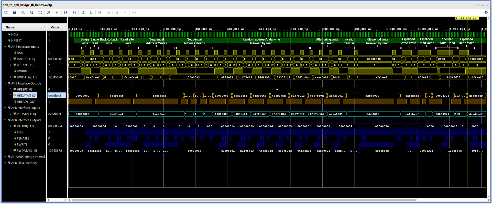

# 🧪 AHB2APB Bridge Testbench

This directory contains the **SystemVerilog testbench** used to **verify the functionality and timing behavior** of the `ahb_to_apb_bridge` module.
The testbench simulates the transaction translation between the high-performance **AMBA AHB bus** and the low-power **APB bus**, validating data transfers, handshaking, pipelining, and idle scenarios.

---

## 🧭 Testbench Overview

The testbench models:

* A **mock AHB master** generating read and write transactions.
* The **AHB-to-APB bridge** as the DUT (Device Under Test).
* A simple **APB memory slave** (`apb_mem.sv`) acting as a register bank.
* Clock and reset generators ensuring synchronous operation.

Both **address and data phases** are emulated as per the AHB protocol, and the bridge’s **state machine** is exercised through various test sequences.

---

## 🧩 Simulation Components

| Component         | Role                                                                     |
| ----------------- | ------------------------------------------------------------------------ |
| **AHB Interface** | Groups AHB master and slave signals for clean connectivity.              |
| **APB Interface** | Encapsulates APB signals between the bridge and peripheral.              |
| **Bridge (DUT)**  | Translates AHB transactions into APB operations.                         |
| **APB Memory**    | Responds to APB operations with read/write access to internal registers. |

---

## 🔍 Test Scenarios

Each test verifies a particular functional or timing aspect of the bridge.

| **Test #**                             | **Description**                                                                                                                           |
| -------------------------------------- | ----------------------------------------------------------------------------------------------------------------------------------------- |
| **1. Single Write & Read**             | Verifies that a single AHB write followed by an AHB read correctly updates and retrieves data from the APB memory.                        |
| **2. Back-to-Back Writes**             | Confirms that consecutive AHB write operations are handled without stalling or data corruption.                                           |
| **3. Write–Read Sequence**             | Ensures the bridge completes write cycles before initiating dependent reads.                                                              |
| **4. Sequential Address Writes/Reads** | Tests access to incrementing addresses to confirm proper address propagation across AHB and APB.                                          |
| **5. Randomized Accesses**             | Randomized addresses and data patterns check bridge reliability and synchronization logic.                                                |
| **6. Alternating Read/Write**          | Evaluates state transition robustness during alternating reads and writes.                                                                |
| **7. Invalid Transfer Handling**       | When `HSEL=0` (no valid slave selected), verifies that the bridge does not initiate unintended APB transfers (`PSEL=0`, `PENABLE=0`).     |
| **8. Idle Period Test**                | Tests bridge stability and reset of control signals during prolonged idle periods.                                                        |
| **9. Pipelined Write**                 | Validates pipelined behavior where address and data phases of consecutive writes overlap — ensuring correct sequencing and data delivery. |
| **10. Pipelined Read**                 | Tests consecutive reads to ensure proper address–data pipeline handling and HRDATA validity.                                              |
| **11. Pipelined Write → Read**         | Confirms bridge’s ability to handle transition from write phase to subsequent read without deadlock.                                      |
| **12. Pipelined Read → Write**         | Verifies the bridge’s readiness control logic when direction switches from read to write in successive cycles.                            |

---

## ⏱ Timing & Synchronization

* Both **HCLK** (AHB clock) and **PCLK** (APB clock) are synchronous in this setup (`PCLK = HCLK`).
* Reset (`HRESETn`, `PRESETn`) is **active-low**, ensuring all registers are cleared before simulation starts.
* Each AHB transaction follows a **two-phase protocol**:

  * **Address Phase** — Master drives address and control signals.
  * **Data Phase** — Bridge completes APB transaction and returns data or response.

---

## 🧮 Verification Goals

* ✅ Functional correctness for all read/write paths
* ✅ HREADY signal compliance
* ✅ No spurious transfers under idle or invalid selections
* ✅ Pipelined transfer handling

---

## 📸 Simulation Outputs

* **Bridge Connection Overview**
  

---

## 📌 Future Work

* Formal Verification using onespin and SVA
* UVM-based verification
* Convert to self checking testbech

*Created by Talha Israr*